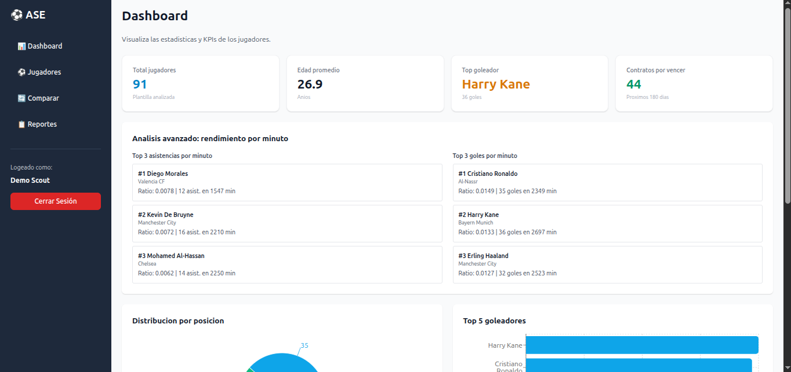
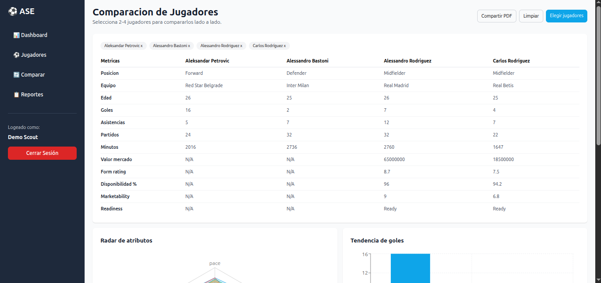
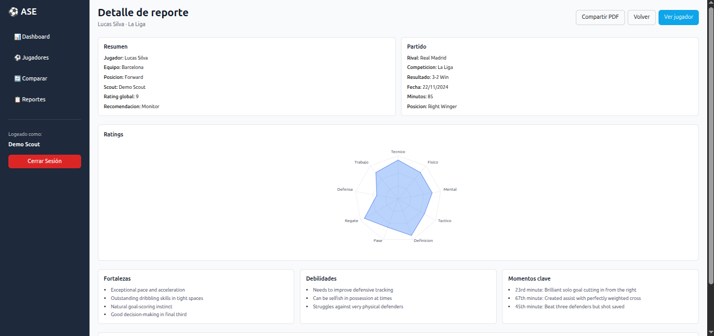

# ASE Athletics - Plataforma de Análisis de Fútbol

## Demostración en Vivo
- **Aplicación Frontend:** [Tu URL de frontend desplegado]
- **API Backend:** [Tu URL de backend desplegado]
- **Documentación de API:** [Swagger UI o URL de documentación]


## Resumen del Proyecto
ASE Athletics es una plataforma web fullstack para el análisis, seguimiento y comparación de jugadores de fútbol, desarrollada para scouts y analistas deportivos. Construida con React 18 + Vite en el frontend y Node.js + Express + MongoDB en el backend.


## Stack Tecnológico
### Frontend
- **Framework:** React 18 con Vite
- **Gestión de Estado:** Context API (`AuthContext`)
- **Estilos:** Tailwind CSS + PostCSS
- **Gráficos:** Recharts (RadarChart, BarChart, LineChart)
- **Librerías adicionales:** React Hook Form + Yup (formularios), Axios (HTTP), React Router DOM v6 (routing), jsPDF + html2canvas (exportación PDF)
### Backend
- **Runtime:** Node.js
- **Framework:** Express.js
- **Base de Datos:** MongoDB con Mongoose
- **Autenticación:** JWT + bcryptjs
- **Validación:** Esquemas Mongoose (server-side) + Yup (client-side)
- **Documentación:** Swagger UI Express + swagger-jsdoc (`/api/docs`)
- **Seguridad:** Helmet, CORS, Morgan
- **Testing:** Jest + Supertest
### DevOps y Despliegue
- Host Frontend: Netlify / Vercel
- Host Backend: Heroku / Railway
- Host Base de Datos: MongoDB Atlas
- Control de Versiones: Git con GitHub
## Configuración de Desarrollo Local

### Prerrequisitos
- Node.js v18 o superior
- MongoDB (local o MongoDB Atlas)
- Git

### 1. Clonar el repositorio
```bash
git clone <url-del-repositorio>
cd ase
```

### 2. Arrancar el Backend

```bash
cd backend
npm install
```

Crea el archivo `.env` en `backend/`:
```env
MONGO_URI=mongodb://localhost:27017/ase_athletics
JWT_SECRET=tu_secreto_jwt_seguro
PORT=5000
CLIENT_URL=http://localhost:5173
```

Poblar la base de datos (solo la primera vez):
```bash
node migrations/seed.js
```

Iniciar el servidor:
```bash
npm run dev
```
> Servidor disponible en `http://localhost:5000`
> Swagger UI disponible en `http://localhost:5000/api/docs`

### 3. Arrancar el Frontend

```bash
cd ../frontend
npm install
npm run dev
```
> Aplicación disponible en `http://localhost:5173`


## Estructura del Proyecto

```
ase/
├── backend/
│   ├── controllers/
│   ├── models/
│   ├── routes/
│   ├── middlewares/
│   ├── migrations/
│   ├── tests/
│   ├── app.js
│   ├── server.js
│   └── .env.example
├── frontend/
│   ├── src/
│   │   ├── components/
│   │   ├── pages/
│   │   ├── context/
│   │   ├── hooks/
│   │   ├── services/
│   │   ├── App.jsx
│   │   └── main.jsx
│   ├── public/
│   └── vite.config.js
├── README.md
├── package.json
└── .gitignore
```

- El directorio `backend/` contiene la API, modelos de datos, rutas, controladores y pruebas.
- El directorio `frontend/` incluye la aplicación React, componentes, páginas, hooks y configuración.
- Los archivos de configuración y documentación están en la raíz del proyecto.


## Capturas de Pantalla

### Dashboard

*Panel principal con KPIs globales: total de jugadores, valor de mercado agregado, contratos próximos a vencer y ranking de goleadores.*

### Métricas Básicas

*Resumen estadístico: goles, asistencias, posiciones y valores de mercado.*

### Listado de Jugadores

*Vista de lista con filtros por posición, edad y rendimiento. Diseño responsive con tarjetas en móvil y tabla en escritorio.*


### Información Básica del Jugador

*Datos generales del jugador: nombre, posición, nacionalidad, equipo y valor de mercado actual.*

### Información Avanzada del Jugador

*Perfil extendido con datos físicos, histórico de valor de mercado y mas parámetros avanzados.*

### Comparación de Jugadores

*Tabla comparativa de 2 hasta 4 jugadores con todas sus métricas clave enfrentadas.*

### Gráficos de Comparación

*Visualizaciones interactivas: radar de atributos, barras de goles/asistencias por jugador y línea de evolución de valor de mercado.*

### Listado de Informes

*Historial de informes de scouting con filtros por jugador y scout, valoración general y acciones rápidas.*

### Detalle de Informe

*Informe completo con valoraciones técnicas, físicas, tácticas y mentales, observaciones y recomendación de seguimiento. Exportable a PDF.*


## Credenciales de Demostración

> Disponibles tras ejecutar `node migrations/seed.js`

| Campo | Valor |
|-------|-------|
| Email | `demo@ase-athletics.com` |
| Contraseña | `demo1234` |
| Rol | Scout |

## Consideraciones de Rendimiento

- **Paginación en todas las listas:** Los endpoints `/players` y `/reports` paginan los resultados (por defecto 20 por página) para evitar cargar colecciones completas.
- **Índices MongoDB:** Índices en `position`, `age`, `marketValue` en la colección `players` para acelerar los filtros más frecuentes del listado.
- **Populate selectivo:** Los `populate()` en Mongoose solo recuperan los campos necesarios (`name`, `team`, `position`) en lugar del documento completo.
- **Debounce en búsqueda:** El hook `useDebounce` en el frontend retarda las peticiones al escribir en el buscador, reduciendo las llamadas a la API.
- **Lazy loading de perfiles:** El `PlayerDetail` (valueHistory, last5Games, scouting) se carga únicamente al acceder al detalle del jugador, no en el listado general.
- **html2canvas con scale:2:** La exportación PDF usa doble resolución para calidad óptima sin bloquear el hilo principal.

## Mejoras Futuras

- **Roles y permisos granulares:** Diferenciar entre rol `admin` (gestión completa) y `scout` (solo sus propios informes y lectura de jugadores).
- **Notificaciones de contratos:** Alertas automáticas por email cuando un contrato está a menos de 90 días de vencer.
- **Filtros avanzados en comparación:** Permitir comparar jugadores filtrando por temporada o rango de fechas.
- **Modo offline / PWA:** Cachear datos de la última sesión para consulta sin conexión.
- **Historial de cambios:** Registro de auditoría que guarde quién y cuándo modificó el perfil de un jugador.
- **Analisis IA:** conexion de la base de datos via MCP (Model context protocol), para poder hacer analisis con muchos mas datos apalancandonos en la potencia de un modelo de lenguaje

---

## Autor

**Adil Bensaid**
Desarrollo fullstack del proyecto ASE Athletics como parte de un entorno académico/profesional.

---

## Aviso Legal y Licencia

Copyright © 2026 Adil Bensaid. Todos los derechos reservados.

Este software y su código fuente son propiedad exclusiva del autor. Se concede permiso para visualizar y ejecutar este proyecto **únicamente con fines de evaluación académica o demostración personal**.

**Queda expresamente prohibido:**

- La venta, sublicencia o comercialización de este software o cualquier parte del mismo.
- La distribución pública o privada del código fuente sin autorización escrita del autor.
- La modificación y redistribución del proyecto bajo otro nombre o identidad.
- El uso del código en productos o servicios comerciales de terceros.

Este proyecto no incluye ninguna garantía implícita ni explícita. El autor no se hace responsable de daños derivados del uso indebido del software.

Para cualquier consulta sobre licenciamiento o uso, contactar directamente con el autor.